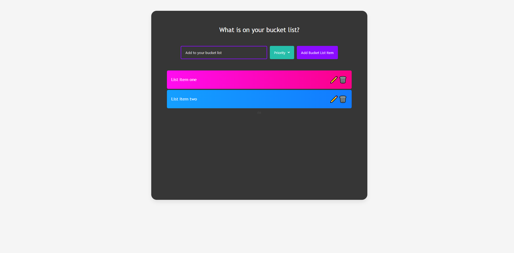
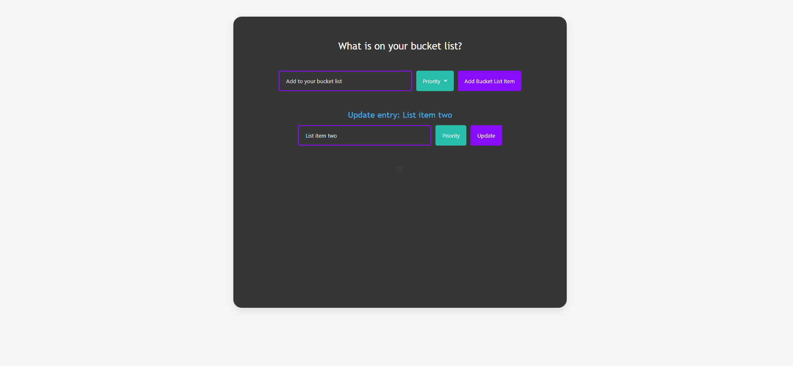

# Bucket List React

[](https://opensource.org/licenses/MIT)
[](https://developer.mozilla.org/en-US/docs/Web/Progressive_web_apps)
[](https://webpack.js.org/)
[](https://reactjs.org/)
[](https://www.javascript.com/)
[](https://developer.mozilla.org/en-US/docs/Glossary/HTML5)
[](https://developer.mozilla.org/en-US/docs/Web/CSS)
[](https://bulma.io/)

## Description

A bucket list where the user can add, modify and delete bucket list items. The application is built using React.

## 📖Table of Contents
1. [Installation](#installation)
2. [Usage](#usage)
3. [Assets](#assets)
4. [Technologies](#Technologies)
5. [License](#license)
6. [Contributing](#contributing)
7. [Tests](#tests)
8. [Questions](#questions)

## Installation
1. To install this application clone it through GitHub using the following code in the terminal: 
    ``` 
    git clone https://github.com/TrushilBudhia/Bucket-List-React.git
    ```
2. To add the dependencies to the application, navigate to the root directory for the application and run:
    ```js
    npm install
    ```
    
## Usage
Navigate to the root directory for the application and run the following code in the terminal to start the application:
```js
npm start
```

Items can be added to the bucket list by using the input field, the drop down menu to select the priority of the item and submitting the entry with the 'Add Bucket List Item'. Once added, the list item can be edited and/or deleted.

## Assets
Live demo of the application hosted on Heroku: [Bucket List React](https://trushilbudhia.github.io/Bucket-List-React/)

The following image shows the functionality of the application: 





## Technologies
- [React](https://reactjs.org/)
- [Webpack](https://webpack.js.org/)
- [Bulma](https://bulma.io/)
- JavaScript
- HTML
- CSS

## License
Copyright © 2021 [Trushil](https://github.com/TrushilBudhia)

This project is [MIT](./LICENSE) licensed

## Contributing
Contributions, issues and feature requests are welcome.

Feel free to check the [issues page](https://github.com/TrushilBudhia/Bucket-List-React/issues) if you want to contribute.

## Tests
There are no tests currently for this application.

## Questions
For any questions, please contact the author:

- Github: [@Trushil](https://github.com/TrushilBudhia)
- Email: trushil.budhia@gmail.com


